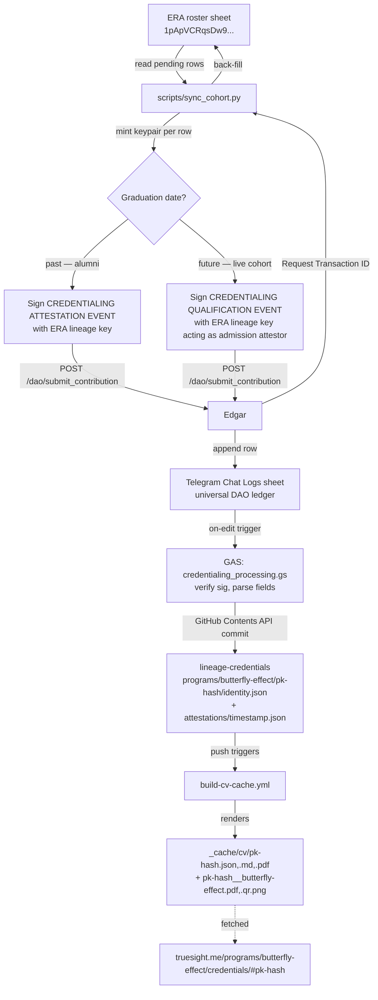

# Butterfly Effects Club — operational repo proposal

**Status:** PROPOSAL · drafted 2026-05-22 · Claude Opus 4.7 implementing
**Predecessor docs in git history:** `PROPOSAL_CLAUDE.md`, `PROPOSAL_DEEPSEEK.md`, `_KIMI.md`, `ASSESSMENT_CLAUDE.md`, `IMPLEMENTATION_LEAD.md` — superseded by this single canonical proposal.
**Authority:** Claude Opus 4.7 elected implementer by Kimi (`IMPLEMENTATION_LEAD.md`) and DeepSeek (`PROPOSAL_DEEPSEEK.md`). This proposal consolidates the best-of-three.

**Companion docs:**
- `agentic_ai_context/CREDENTIALING_PLATFORM.md` — overall credentialing data model
- `agentic_ai_context/CREDENTIALING_PROGRAM_PAGES.md` — `truesight.me/programs/<slug>/` URL/page convention
- `agentic_ai_context/BUTTERFLY_EFFECT_COHORT_ONBOARDING_PLAN.md` — the ERA partnership plan (2026-05-18)

If anything below conflicts with those, those win and this is wrong.

---

## 1. Why this repo exists

ERA Professionals shared a 98-row cohort sheet ([`1pApVCRqsDw9...`](https://docs.google.com/spreadsheets/d/1pApVCRqsDw9AjPUTc3fMUfMh-8H4Ne1HYuQ_d6xItog/edit?gid=0#gid=0)) of Butterfly Effect students and alumni. They are the first partner-program cohort to land at material scale. This repo provides:

1. The **program-owned operational scripts** that read ERA's sheet and emit signed events to Edgar.
2. The **administrative console** for ERA's team at `butterfly-effect-club.truesight.me` (GitHub Pages).
3. The **ERA sheet schema** in `SCHEMA.md`, LLM-discoverable.
4. The **administrator allowlist** (`admins.json`), versioned and auditable.

It is **NOT**:

- A parallel credential mirror. Public credentials stay at `truesight.me/programs/butterfly-effect/credentials/#<slug>` — frozen by design per `CREDENTIALING_PROGRAM_PAGES.md §3` (etched into printed cert QRs).
- A data home for participant records — those live in `TrueSightDAO/lineage-credentials/programs/butterfly-effect/pk-<hash>/`.
- A generic cohort-onboarding framework. Each future partner brings its own schema.

## 2. Architectural decisions (consolidated)

| # | Decision | Source / rationale |
|---|---|---|
| 2.1 | Repo at `TrueSightDAO/butterfly-effect-club` (hyphen, matches subdomain + program slug everywhere else) | All three drafts converged |
| 2.2 | Subdomain `butterfly-effect-club.truesight.me` is the **admin console only** — never a credential URL | All three drafts converged |
| 2.3 | `admins.json` is the **primary** auth gate. Sheet-editor membership is **informational only** (badge, not gate) | Resolves Kimi §4.1 vs DeepSeek §14 — adopting Claude's compromise to avoid GAS-endpoint identity-verification rabbit hole |
| 2.4 | Bootstrap via **Edgar event submission**, one event per row (`POST /dao/submit_contribution`). Direct GitHub Contents API commit is **not used.** | Aligns with `CREDENTIALING_PLATFORM.md §6` GAS-handler pattern; keeps Telegram Chat Logs as universal ledger |
| 2.5 | **Single attestation event for alumni rows** (graduation_date ≤ today). Two events (admission + completion) only when the row represents a live student still in cohort. Script branches on `graduation_date`. | Resolves Kimi §6 (two events) vs Claude §2.1 (one event) — hybrid is the honest fit for the alumni-heavy roster |
| 2.6 | Event type vocabulary is the **generic platform set**: `[CREDENTIALING ATTESTATION EVENT]` (and `[CREDENTIALING QUALIFICATION EVENT]` only when the live cohort requires the two-event split). **No program-scoped event names** (`[BUTTERFLY EFFECT PROFILE EVENT]` etc. are rejected) | Per `CREDENTIALING_PLATFORM.md §4` — program-scoped event names fragment Edgar's dispatch surface |
| 2.7 | **Participant private keys are ephemeral.** Mint, derive `pk-<hash>`, export public to identity.json + sheet, **discard private.** No `keys/` directory. The participant pk is only a folder identifier; ERA's lineage key carries trust. | Resolves Kimi's override-1 critique of my original `keys/` proposal — Kimi's `.gitignore`-as-custody concern is right, but the answer is "don't retain keys" not "send via WhatsApp" |
| 2.8 | **WhatsApp DM private-key transit is rejected.** WhatsApp Cloud-backs DMs to Drive/iCloud — same threat the platform was designed to avoid. Participant key adoption happens via the deferred self-serve claim flow (platform §13). | Overrides Kimi §4.2 |
| 2.9 | `pk-hash` derivation is **canonical**: `pk-` + first 12 chars of `base64url(SHA-256(base64-decoded public-key bytes))`. Matches `tokenomics/google_app_scripts/tdg_credentialing/practice_event_processing.gs::deriveSlug()`. | Codified for cross-language parity (Python script + JS panel + GAS handler all derive the same string) |
| 2.10 | ERA lineage signing key — **Bilal's existing registered key** (row 63 of [Contributors contact information](https://docs.google.com/spreadsheets/d/1GE7PUq-UT6x2rBN-Q2ksogbWpgyuh2SaxJyG_uEK6PU/edit?gid=1460794618#gid=1460794618), public half on the [Contributors Digital Signatures](https://docs.google.com/spreadsheets/d/1GE7PUq-UT6x2rBN-Q2ksogbWpgyuh2SaxJyG_uEK6PU/edit?gid=577022511#gid=577022511) tab) **OR** a fresh key Bilal mints via the admin panel's signing module. Either is acceptable. Script looks up the attestor pubkey by name at runtime. | Gary's decision 2026-05-22 — uses existing DAO contributor signature when present, no need to mint program-scoped key |
| 2.11 | `public_listable: true` default for all rows in the ERA sheet — the row's presence on a curated, institutionally-managed roster IS the consent. Per-record override available via an explicit `public_listable_override` column for participants Bilal wants to keep off the searchable directory (e.g., specific minors). | Gary's decision 2026-05-22 — institutional cohort import is the consent-capture moment; platform §9 default was written for self-create flows that don't apply here |
| 2.12 | `identity.json` includes `former_pk_hashes: []` array for re-onboarding after key loss. | DeepSeek §16.4 |
| 2.13 | Script default is `--dry-run`. `--execute` is opt-in to apply. Matches `onboard_retail_partner.py` precedent. | All three drafts agreed, but only my draft made dry-run the default |
| 2.14 | **GAS scanner for continuous additions is deferred to v1.1.** v1 ships the Python bootstrap only. | DeepSeek §16.1 — bootstrap-vs-ongoing split |
| 2.15 | **Self-serve `create_signature.html` adaptation is deferred to v1.1.** Requires the email column on the roster, which may not exist. | DeepSeek §13 |
| 2.16 | ERA roster cohort tab is named **`Cohort Roster`** — year-agnostic; one tab holds alumni + current cohort with `graduation_date` discriminating. | Gary's decision 2026-05-22 |
| 2.17 | `admins.json` is split into `manual_overrides[]` (hand-curated, includes Gary and DAO-side operators) and `synced_from_sheet_editors[]` (auto-regenerated daily by a separate `admins_sync.yml` workflow that calls the GAS proxy to fetch sheet editor list and resolves each editor's pubkey on Main Ledger Contributors Digital Signatures). Auth checks the union. | Gary's suggestion 2026-05-22 |
| 2.19 | **Admin auth = runtime resolution.** The panel hosts the existing dapp `create_signature.html` flow at `butterfly-effect-club.truesight.me`. When anyone (Gary / Bilal / Sheeran / future admin) goes through the flow: (1) panel mints or loads pubkey in localStorage, (2) fires `[REGISTER KEY EVENT]` to Edgar — which writes to Main Ledger Contributors Digital Signatures, (3) panel then queries: "is my pubkey on Contributors Digital Signatures? What email maps to it? Is that email also an editor of the Cohort Roster sheet?" If yes to both → admin mode. `admins.json` is downgraded to a minimal bootstrap seed for DAO-side operators (Gary) who may not be Cohort Roster editors. No manual `admins.json` maintenance needed for ERA-side admins. | Gary's clarification 2026-05-22 |
| 2.20 | **No participant emails captured at bootstrap.** Per Bilal: students/parents primarily use WhatsApp; no email column added until a concrete use case requires participants to interact with the admin panel. Defers self-serve claim flow (platform §13) until that need is real. | Bilal's response 2026-05-22 |
| 2.21 | **Credential page is text-only — no photos.** Per Bilal: the credential page shows participant text (name, school, learner type, graduation date). The certificate PDF gets printed, manually signed by ERA, and the QR on it points at the text profile page. Scanning the QR brings the parent/student to the profile. Photo-consent question moot. | Bilal's response 2026-05-22 |
| 2.22 | **Cohort Roster has 97 data rows** (not 98 as initially reported). All graduate dates are in the past → all rows take the alumni `single-attestation` path. 84 students, 13 teachers. 3 schools: Narowal Public School (46), IMSG Islamabad (32), CMS Karachi (19). | Dry-run output 2026-05-22 |
| 2.23 | **Sheet date format is "DD MMM YYYY" (e.g. "30 Aug 2024"), not ISO 8601.** Parser uses `python-dateutil` with `dayfirst=True`. Don't ask Bilal to reformat — accommodate the existing column. | Dry-run output 2026-05-22 |
| 2.24 | **Canonical credentialing GAS handler lives in `tokenomics`, not per-program.** `tokenomics/google_app_scripts/tdg_credentialing/attestation_event_processing.gs` handles `[CREDENTIALING ATTESTATION EVENT]` for *all* programs: verify signature, look up attestor against program manifest's `authorized_attestors[]`, commit `identity.json` + `attestations/<ts>.json` to `lineage-credentials/programs/<Program>/<pk-hash>/`. Program slug routes to the right subfolder. **Zero per-program GAS to deploy on the tokenomics side.** | Gary's clarification 2026-05-22 — overrides earlier "GAS lives in this repo" position |
| 2.25 | **Per-program work in this repo shrinks to admin panel only.** No per-program GAS write-proxy required. Reads handled either by (a) public CSV publish of the roster, (b) a tiny read-only GAS, or (c) fetching panel state from `lineage-credentials/_cache/index.json` filtered by program. **All writes are done by the central tokenomics SA.** | Refined per Gary 2026-05-22 |
| 2.26 | **Attestation UX:** admin visits `butterfly-effect-club.truesight.me`, runtime-resolves to admin mode (§2.19), sees pending-rows queue. Click "Attest <name>" → browser signs `[CREDENTIALING ATTESTATION EVENT]` with localStorage key (event payload carries `Roster Source URL` + `Roster Source Row` + `Schema URL` for self-describing routing — see §2.28) → POST to Edgar → done from the panel's side. Tokenomics central handler picks up the event and back-fills the sheet + lineage-credentials. Admin shares panel URL on WhatsApp; any other authorized admin can pick up the remaining queue. **Distributed signing — α option from the Q&A: each admin signs with their own key.** Each admin's pubkey goes into the program manifest's `authorized_attestors[]`. | Gary's UX 2026-05-22, signer choice α |
| 2.27 | **Program manifest `authorized_attestors[]` is the trust circle.** Lives at `truesight_me/programs/butterfly-effect/manifest.json`. Initial entries: Gary, Bilal, Sheeran, Shahbaz (resolved via Main Ledger Contributors Digital Signatures once they each register a key). The central tokenomics handler rejects any `[CREDENTIALING ATTESTATION EVENT]` whose `Attestor Public Key` is not in this list. **Manifest is a regular `truesight_me` PR — no API to maintain it.** | Trust-model anchor |
| 2.28 | **Self-describing event payload.** `[CREDENTIALING ATTESTATION EVENT]` carries three routing fields beyond the platform-standard ones: `Roster Source URL` (which spreadsheet), `Roster Source Row` (which row 1-indexed), `Schema URL` (link to this repo's SCHEMA.md for documentation/LLM consumption). The central handler reads these fields verbatim to find where to back-fill. **No central registry needed — the event is the registry.** | Gary's refinement 2026-05-22 |
| 2.29 | **Single writer principle.** Only the tokenomics central SA writes to program roster sheets. Each new program shares its roster (editor permission) with that SA. No admin browser → sheet write path; no per-program SA write path. Tight audit boundary: every sheet mutation traces to one identity. | Gary's refinement 2026-05-22 |
| 2.30 | **Standard audit column names — platform-wide convention.** All program rosters share the audit-column vocabulary: `public_key`, `pk_hash`, `attestation_tx_id`, `qualification_tx_id`, `profile_url`, `credential_pdf_url`, `certificate_url`, `status`, `processed_at`, `github_commit_sha`, `notes`, `public_listable_override`. Central handler looks up by **header name** (case-insensitive on row 1), not by column index — so programs can add or reorder columns freely. The `Audit Trail` tab convention is the same — sibling tab on the same spreadsheet with stable column names. | Same |
| 2.31 | **`config.json` at the repo root is the program's bootstrap config.** Contains: program slug + display name, roster sheet URL + sheet ID, roster tab name + audit-trail tab name, GAS proxy URL, schema URL, public credential URL template, Edgar endpoint, lineage-credentials path. The admin panel fetches `./config.json` at boot to know where everything lives. The signed event carries `Config URL` so the central tokenomics handler can fetch the same config (or just resolve `Roster Source URL` directly from the event). | Gary 2026-05-22 — codifies the panel boot sequence |
| 2.32 | **Trust source = sheet editor list.** v1 trust circle is "whoever is an editor on the roster sheet." Both the admin panel (auth gate at boot) and the central tokenomics handler (signature verification) call the GAS proxy's `?action=list_editors` endpoint to resolve the trust list. **No static `authorized_attestors[]` to maintain manually.** Add or remove an admin = add or remove a sheet editor. If the GAS proxy is down, attestations fail closed (safe default). | Gary 2026-05-22 — supersedes earlier §2.27 idea of a static manifest list |
| 2.33 | **Cert template assets live in this repo (`cert_template/`)**, not in `lineage-engine/scripts/program_assets/butterfly-effect/`. Files: `cert_config.json` (overlay coordinates), `cert_template.pdf` (base design), `logo.png` (used both on the cert and as the QR centre logo), `fonts/`. Stable raw.githubusercontent URLs published via `config.json::cert_template.base_url`. **`lineage-engine`'s `build_cv_cache.py` will be updated in a follow-up PR to fetch from this URL** instead of reading its local vendored copy. Migration codifies the principle: program-specific assets live with the program. | Gary 2026-05-22 |
| 2.34 | **No per-event `Certificate Template URL` field.** The cert template URL is in the program's `config.json`, which the central handler reaches via the event's `Config URL` (§2.28). Adding another field on every event would be duplicative — config is the single resolution point for everything program-scoped. | Same |
| 2.35 | **New-program onboarding cost = 2 share clicks + 1 fork + 1 manifest PR.** Operator actions: (1) share roster sheet with tokenomics SA as editor, (2) share roster sheet with desired admin emails as editors (= the trust circle), (3) fork this repo, edit `config.json` with new sheet URL + slug, drop new `cert_template/` assets, deploy GitHub Pages with new CNAME, (4) PR to `truesight_me/programs/<slug>/manifest.json` for brand endorsement. No tokenomics or lineage-engine PR required. | Gary 2026-05-22 — payoff of v3 architecture |
| 2.36 | **Two-tier program model.** **Tier 1 (DAO-endorsed):** truesight_me manifest exists; credentials live at `truesight.me/programs/<slug>/...`; partner co-brand applied; listed on `truesight.me/programs.html`. Reviewed via governance PR. *Butterfly Effect = Tier 1.* **Tier 2 (self-serve, permissionless):** anyone forks the program-club template, runs on their own subdomain, shares their sheet with tokenomics SA. Infrastructure works (Edgar events, lineage-credentials commits, PDF rendering) but credentials live under *their* domain — no DAO brand. Tier-1 endorsement is gatekept; the underlying credentialing infrastructure is permissionless. v1 implements Tier 1 only; Tier 2 is a forward-looking design choice not built for v1. | Gary 2026-05-22 — separates "infrastructure use" from "DAO endorsement" |
| 2.37 | **`truesight_me/programs/<slug>/manifest.json` is the single per-program registry.** Extends with three new fields: `roster_sheet_url` (the program's Google Sheet), `tokenomics_admin_endpoint` (the central GAS URL), and `admin_panel_url` (the program's admin console, e.g. `https://butterfly-effect-club.truesight.me/`). The manifest becomes a discoverable index pointing at every surface for the program. The admin panel itself reads this manifest from `truesight.me/programs/<slug>/manifest.json` at boot — no separate config file lookup needed for routing. Per-program `config.json` shrinks to assets-only (cert template paths). | Gary 2026-05-22 — consolidates the per-program registry into one file |
| 2.38 | **Single central tokenomics GAS handles BOTH trust resolution AND event processing.** `tokenomics/google_app_scripts/tdg_credentialing/program_admin_endpoint.gs` exposes: (a) `?action=list_sheet_editors&sheet_url=<URL>` — returns editor emails for any sheet the tokenomics SA has access to (used by every program's admin panel for auth); (b) Edgar webhook handler — processes `[CREDENTIALING ATTESTATION EVENT]` (commits to lineage-credentials + back-fills source sheet). One deployment serves every program. No per-program GAS, ever. | Gary 2026-05-22 — supersedes earlier per-program GAS proxy idea (§2.25) |
| 2.39 | **Trust circle = sheet editors, resolved live.** Supersedes earlier Path B (`config.json::authorized_attestors[]`). The central GAS's `list_sheet_editors` is consulted at runtime by both the admin panel (auth gate) and the attestation handler (signature trust check). Adding/removing admin = sharing/unsharing sheet. Zero static lists to maintain. | Gary 2026-05-22 — final form of §2.32 |
| 2.40 | **Program mode is typed implicitly by which manifest fields are present.** A `truesight_me/programs/<slug>/manifest.json` *without* `roster_sheet_url` + `admin_panel_url` is a **practitioner activity-tracking** program (e.g., capoeira-tribo-mirim — practitioners self-track sessions, no institutional attestation). A manifest *with* those two fields is a **cohort credentialing** program (e.g., butterfly-effect — institutional attestation, roster managed by program admins). Both modes coexist under `truesight.me/programs/`. The central tokenomics handler dispatches by inspecting the manifest. Hybrid programs (both fields *and* `practice_types`) are theoretically supported. | Gary 2026-05-22 — natural typing via optional fields |
| 2.18 | **Service account access scope:** the `butterfly-effect-club@get-data-io.iam.gserviceaccount.com` service account gets editor on the ERA Cohort Roster sheet (granted 2026-05-22) and **read on the Main Ledger** (`1GE7PUq-...`, needed for attestor + admin pubkey lookups). It does **NOT** get access to Telegram Chat Logs — Edgar mediates all event ledger reads. Same pattern recommended for future programs: program-scoped sheet + Main Ledger read; never direct Telegram Chat Logs. | Gary's question 2026-05-22 — scaling principle codified |

## 3. Repo layout

```
TrueSightDAO/butterfly-effect-club/        (GitHub Pages → butterfly-effect-club.truesight.me)
├── README.md                              repo overview, links to SCHEMA + scripts
├── PROPOSAL.md                            this document
├── SCHEMA.md                              ERA sheet URL, service-account email, column glossary, pk-hash derivation reference
├── admins.json                            authorized administrators (pubkey + Google email)
├── CNAME                                  butterfly-effect-club.truesight.me
├── index.html                             admin console (Pages root)
├── assets/
│   ├── butterfly-effect-logo.png          vendored partner logo
│   ├── css/
│   └── js/
│       ├── keygen.js                      WebCrypto RSA-2048, adapted from dapp/create_signature.html
│       └── auth.js                        admins.json check, localStorage key inspection
├── scripts/
│   ├── README.md                          how to run sync locally
│   ├── requirements.txt                   gspread, google-auth, requests, cryptography
│   └── sync_cohort.py                     reads ERA sheet → mints pk → signs event with ERA lineage key → POSTs Edgar → back-fills sheet
├── .gitignore                             google_credentials.json, era_lineage_*.pem, .env, __pycache__
└── (gitignored) google_credentials.json   service account for sheet read+write
└── (gitignored) era_lineage_private.pem   ERA's lineage signing key — Gary's machine only
```

## 4. Data flow



Participant private key is generated inside `sync_cohort.py`, used to derive `pk-<hash>` and to populate the event's `Practitioner Public Key` field, then **garbage-collected with the process**. Only the public half persists (in identity.json on lineage-credentials, plus the public_key column on the ERA sheet).

## 5. SCHEMA.md (will live in repo)

### 5.1 ERA roster source columns

| Col | Label | Type | Notes |
|---|---|---|---|
| A | Name | string | → `identity.json.names[0]` |
| B | School | string | → `identity.json.metadata.school` |
| C | Learner Type | enum (`student` / `teacher`) | → drives credential template variant |
| D | Graduation Date | ISO date | past = alumni single-event path; future = live-cohort two-event path |

### 5.2 Columns added by `sync_cohort.py`

| Col | Label | Filled when | Notes |
|---|---|---|---|
| E | `public_key` | row first processed | Full base64 SPKI (public half only) |
| F | `pk_hash` | row first processed | `pk-` + 12 chars base64url(SHA-256(decoded pubkey)) — folder name |
| G | `attestation_tx_id` | after Edgar 200 | Edgar's `Request Transaction ID` (RSA signature, base64) — cryptographic audit anchor |
| H | `qualification_tx_id` | live-cohort path only | Optional second tx_id for the admission event |
| I | `profile_url` | after Edgar 200 | `https://truesight.me/programs/butterfly-effect/credentials/#<pk_hash>` |
| J | `credential_pdf_url` | after build-cv-cache lands | `https://cdn.jsdelivr.net/gh/TrueSightDAO/lineage-credentials@main/_cache/cv/<pk_hash>__butterfly-effect.pdf` |
| K | `certificate_url` | live-cohort completion event lands | Same family — only populated post-completion attestation for live-cohort path |
| L | `status` | each run | `pending` / `profile_created` / `certificate_issued` / `failed` |
| M | `processed_at` | each successful step | ISO 8601 UTC |
| N | `github_commit_sha` | after GAS commit observable | Secondary breadcrumb to attestation_tx_id |
| O | `notes` | on failure | Human-readable error |

**No private key column.** Anywhere.

### 5.3 Audit Trail tab on ERA sheet

Adopting Kimi §7 verbatim — mirrors the existing "DApp Remarks" pattern:

| Col | Content |
|---|---|
| A | `processed_at` (ISO datetime) |
| B | `name` |
| C | `action` (`profile_created` / `certificate_issued` / `failed` / `key_generated`) |
| D | `github_commit_sha` |
| E | `profile_url` |
| F | `credential_pdf_url` |
| G | `certificate_url` |
| H | `error_message` |
| I | `triggered_by` (operator pk_hash from admins.json) |

### 5.4 `identity.json` shape

```json
{
  "primary_public_key": "<base64 SPKI of admin-minted placeholder pubkey>",
  "names": ["Maria Santos"],
  "emails": [],
  "linked_at": "2026-05-22T14:00:00Z",
  "metadata": {
    "school": "ERA Academy Lahore",
    "learner_type": "student",
    "program_year": "2025-2026",
    "graduation_date": "2026-06-15"
  },
  "alternate_public_keys": [],
  "former_pk_hashes": [],
  "public_listable": false
}
```

- `public_listable: false` is the default for this program (youth). Flipped to `true` per-record after ERA captures guardian consent.
- `alternate_public_keys[]` populated when the student later self-claims (platform §13 flow).
- `former_pk_hashes[]` populated only if a participant is re-onboarded after key loss; old `pk-<hash>` folder stays as orphan, new one references the old hash here for audit continuity.

## 6. Event payload formats

Mirrors the existing Edgar event-payload shape (CREDENTIALING_PLATFORM.md §4) — RSA-SHA256 signed, multipart `POST /dao/submit_contribution`, `Verify submission here:` trailer.

### 6.1 Alumni path — single `[CREDENTIALING ATTESTATION EVENT]`

```
[CREDENTIALING ATTESTATION EVENT]
- Program: butterfly-effect
- Attestation Type: program-completion
- Attestor Public Key: <ERA lineage public key>
- Attestor Name: ERA Professionals — Butterfly Effect
- Attestee Public Key: <participant-pubkey, admin-minted placeholder>
- Attestee Name: Maria Santos
- Captured At: 2026-05-22T14:00:00Z
- Program Year: 2025-2026
- Source URL: https://butterfly-effect-club.truesight.me/
- Payload JSON:
{
  "decision": "approved",
  "school": "ERA Academy Lahore",
  "learner_type": "student",
  "graduation_date": "2026-06-15"
}

My Digital Signature: <ERA lineage public key>

Request Transaction ID: <RSA-SHA256 signature of canonical payload>

This submission was generated using https://butterfly-effect-club.truesight.me/
Verify submission here: https://dapp.truesight.me/verify_request.html
```

### 6.2 Live-cohort path — pair of events

**Admission** = `[CREDENTIALING QUALIFICATION EVENT]` signed by ERA acting as the admitting authority (deviation from the platform's "student-signs-qualification" pattern — explicit note in the payload). Allows the profile to render immediately.

**Completion** = `[CREDENTIALING ATTESTATION EVENT]` signed by ERA on graduation, references the admission `Request Transaction ID`.

The qualification-as-admission is a documented deviation: platform §4b says qualifications are student-signed. We're using the event type with `signer_role: institutional-admission` in the payload to flag the deviation; if the platform team objects, fall back to two `[CREDENTIALING ATTESTATION EVENT]`s with `Attestation Type: program-admission` and `program-completion`.

## 7. `sync_cohort.py` contract

**Inputs:**
- `GOOGLE_APPLICATION_CREDENTIALS` env var → `google_credentials.json` path (service-account read+write on ERA sheet)
- `ERA_LINEAGE_KEY_PATH` env var → path to ERA's lineage private key PEM (local-only)
- `ERA_SHEET_ID` env var → `1pApVCRqsDw9...`
- `EDGAR_ENDPOINT` env var → `https://edgar.truesight.me/dao/submit_contribution` (or wherever)

**Flags:**
- `--dry-run` (default) — log what would happen; touch nothing
- `--execute` — actually mint, sign, POST, back-fill
- `--row <n>` — process only row n (1-indexed in the ERA sheet, header excluded)
- `--rebuild-row <n>` — force re-process even if status==processed

**Per-row algorithm:**
```
1. Read row; skip if status==processed AND attestation_tx_id present
2. Generate RSA-2048 keypair in-process (cryptography.hazmat.primitives.asymmetric.rsa)
3. Derive pk_hash = "pk-" + base64url(SHA-256(public_bytes_der))[:12]
4. Build event payload (alumni or live-cohort branch based on graduation_date)
5. Sign event with ERA lineage private key
6. POST to Edgar; capture Request Transaction ID from response
7. Back-fill sheet: public_key, pk_hash, attestation_tx_id, profile_url, status=profile_created, processed_at
8. Append Audit Trail row
9. Garbage-collect the per-row participant private key (Python scope exit)
```

**Idempotency invariants:**
- Step 1 makes rerun safe.
- If step 6 succeeds but step 7 fails (sheet write hiccup): next run sees Edgar already has the event (sheet `attestation_tx_id` is empty but a lookup would find it). The script polls Edgar by canonical payload hash to recover the tx_id and resume from step 7.
- If step 6 fails entirely: row stays `pending`; next run retries from step 2 (new keypair, that's fine — no record of the prior attempt persisted anywhere).

**Failure mode:** Any exception inside the per-row block writes `status=failed` + `notes` column with the error, then continues to the next row. No partial-batch poisoning.

## 8. Admin console (`index.html`)

Static HTML at the Pages root. No backend. Driven by `config.json` (§2.31) — to onboard a new program, fork this repo and edit `config.json`.

**Boot sequence (config-driven):**

1. Panel fetches `./config.json` from same origin → reads `roster.sheet_url`, `roster.gas_proxy_url`, etc.
2. Panel checks `localStorage` for an existing keypair (same convention as `dapp/create_signature.html`).
3. If no key → panel embeds the `create_signature.html` flow. User generates RSA keypair (private stays in localStorage; public emitted via `[REGISTER KEY EVENT]` → Main Ledger Contributors Digital Signatures).
4. Panel calls `<roster.gas_proxy_url>?action=resolve_admin&pubkey=<base64>`. The GAS proxy:
   - Looks up pubkey on Main Ledger → Contributors Digital Signatures → resolves to email + display name.
   - Cross-checks the resolved email against the roster sheet's own editor list (Drive permissions).
   - Returns `{ is_admin: bool, display_name, email }`.
5. **Admin mode:** render attestation queue. **Public mode:** render program info + "Request access" hint.

**Admin-mode surfaces (v1):**
- **Attestation queue** — table of unprocessed roster rows (status != processed). Each row has an "Attest" button.
- **Click "Attest"** → browser builds `[CREDENTIALING ATTESTATION EVENT]` with self-describing routing fields (§2.28: `Roster Source URL`, `Roster Source Row`, `Schema URL`, `Config URL`). Signs with localStorage RSA key. POSTs to Edgar. Tokenomics central handler processes the rest (commit to lineage-credentials + back-fill sheet).
- **Live status indicator** — once Edgar 200s, row shows "submitted, processing…" and polls the roster sheet (via GAS proxy) for the back-fill to land. Typically <60 seconds.
- **Logged-in indicator** — display name from the resolver lookup, "Sign out" clears localStorage.
- **Share link** — copy-button for `butterfly-effect-club.truesight.me`, ready to drop into WhatsApp so the next admin can pick up the queue.

**Deferred to v1.1:**
- "Issue certificate" UI as a distinct action from initial attestation (only relevant when a live-cohort row reaches completion — alumni rows do both in one event).
- Manual claim-binding UI (only if a student / teacher self-generates a key in a future use case).

## 9. `admins.json` — REMOVED

Per §2.32 the **sheet editor list is the trust circle**. There is no static admin file. To add or remove an administrator:

1. Open the [Cohort Roster sheet](https://docs.google.com/spreadsheets/d/1pApVCRqsDw9AjPUTc3fMUfMh-8H4Ne1HYuQ_d6xItog/edit).
2. Click "Share" → add/remove the person's Google email with Editor permission.
3. Done. Next time they visit `butterfly-effect-club.truesight.me`, the GAS proxy's `resolve_admin` check picks up the change.

The DAO-side operator concern (someone who's a governor but not a sheet editor) resolves naturally: that person gets added as a sheet editor too. Gary is already an editor.

## 10. Decisions made (2026-05-22 conversation)

All §10 items resolved. Summary table for the record:

| # | Decision | Resolution |
|---|---|---|
| 10.1 | ERA lineage key origin | Bilal's existing key on Main Ledger Contributors Digital Signatures (looked up by name from row 63 of Contributors contact info); OR a fresh key Bilal mints via the admin panel's create_signature module on first login. Either is acceptable. |
| 10.2 | Live-cohort admission event type | `[CREDENTIALING ATTESTATION EVENT]` with `Attestation Type: program-admission`. |
| 10.3 | Admin panel reads sheet | GAS proxy. No CSV export. |
| 10.4 | `sync_cohort.py` trigger | Daily cron via GitHub Actions + `workflow_dispatch` for manual runs + local execution by Gary as needed. |
| 10.5 | First batch size | 10 rows first, review, then remaining 88. |
| 10.6 | Repo visibility | Public. Credentials as base64-encoded env vars / GitHub Actions secrets. No JSON committed. |
| 10.7 | GitHub Pages source | `main` branch root. |
| 10.8 | Email column on ERA roster | Add it. Bilal email request. |
| 10.9 | Photo consent | Assumed established — Bilal already shared participant cert-holding photos. To confirm in writing with Bilal. |
| 10.10 | `public_listable` default | `true` for all rows. ERA's curated sheet IS the consent capture. Per-record `public_listable_override: false` column available for participants Bilal wants kept off the directory. |

## 10b. Bilal's responses (2026-05-22)

1. **Signing key path → admin auth flow.** Bilal proposed (and Gary adopted) the unified approach codified in §2.19 — the create_signature.html flow on `butterfly-effect-club.truesight.me` doubles as both key registration AND admin authentication. No separate "confirm existing key" step needed; whoever goes through the flow first becomes a recognized admin if their email is on the Cohort Roster editor list.
2. **Email column → deferred.** Students/parents use WhatsApp, not email. Defer until a concrete admin-panel use case for participants exists.
3. **Photo consent → moot.** No photos on credential pages. Text-only profile + printed-and-signed certificate with QR pointing at the profile. See §2.21.
4. **Minors / `public_listable` → all public.** §2.11 default stands.
5. **First sweep → dry-run only for now.** No `--execute` runs until docs/UX are reviewed.

## 10c. Outstanding ERA actions (none block continuing)

- **Sheeran** (ERA operator who triggers cert issuance by updating the Cohort Roster) needs to be added as a Cohort Roster editor (so the runtime auth resolves her as an admin) if she's not already.
- Sheet stays as-is; date format "DD MMM YYYY" is accommodated by the parser.

## 11. Phased implementation

| Phase | Deliverable | Acceptance test |
|---|---|---|
| **0** | This PROPOSAL.md committed; intermediate files cleaned up | Repo has one canonical proposal |
| **1** | `SCHEMA.md`, `admins.json` (seeded with Gary + Bilal), `.gitignore`, `CNAME`, `README.md` | Repo scaffold reviewable in one PR |
| **2** | `scripts/sync_cohort.py` skeleton — `--dry-run` walks the sheet, prints planned actions, doesn't touch Edgar | Operator can run `python sync_cohort.py --dry-run --row 1` and see correct output |
| **3** | `sync_cohort.py` end-to-end — `--execute` on a single test row produces a live profile at `truesight.me/programs/butterfly-effect/credentials/#<pk_hash>` | First profile renders; cert PDF generates |
| **4** | First-batch sweep (rows 1–10) | All 10 profiles render; no failed rows |
| **5** | Full-cohort sweep (remaining rows) | All 98 profiles render; Audit Trail tab complete |
| **6** | `index.html` admin console — auth gate + read-only dashboard | Admin logs in, sees 98/98 dashboard |
| **7** | DNS — `butterfly-effect-club.truesight.me` CNAME → `truesightdao.github.io` | Subdomain serves the admin console |
| **v1.1** | GAS scanner for ongoing additions + self-serve claim flow + per-row claim-binding UI | Deferred until §10 decisions land and v1 is proven |

Each phase ships as one PR. Reverts cleanly.

## 12. What this proposal explicitly defers

- **WhatsApp self-claim flow** — design exists in platform §13; out of scope here.
- **GAS scanner for continuous additions** — see DeepSeek's §11 in git history; v1.1.
- **Self-serve `create_signature.html` claim** — v1.1.
- **Autopilot ↔ credentialing read-access integration** (`BUTTERFLY_EFFECT_COHORT_ONBOARDING_PLAN.md §4.1`) — deferred until first 10–20 students live.
- **Multi-step lineage chains** — platform §4d; not v1/v2.
- **Photos on credential pages** — pending ERA's consent answer.

## 13. Credits

This proposal consolidates input from three model drafts. Git history preserves the originals.

- **Kimi** — audit trail design (§5.3, mirrors DApp Remarks pattern), data-mapping clarity, MVP-feasibility framing, override critique that drove the ephemeral-key decision.
- **DeepSeek** — production-pattern depth (GAS helpers, signature payload precision, CNAME/Pages convention), bootstrap-vs-ongoing sequencing, edge-case catches (`former_pk_hashes`, `public_listable: false` for minors, email column gap), and the elected implementation recommendation.
- **Claude (implementer)** — security model (no WhatsApp DM, no `keys/` directory, ephemeral participant keys), event-vocabulary discipline (no program-scoped event names), single-event alumni path, `--dry-run` default, local-only key storage precedent (`seed_dao_cvs.py`).

---

*Drafted by Claude Opus 4.7. Awaiting Gary's review of §10 decisions before scaffolding starts.*
